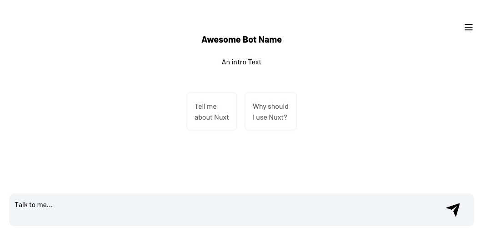

# intrinsify Assistant UI for ChatGPT



A user-friendly UI for ChatGPT - built with Nuxt.

Special thanks to [@mannIL](https://github.com/mannIL) on GitHub for his significant contributions and ideas to this repository.

## Table of Contents

- [Introduction](#introduction)
- [Features](#features)
- [Demo](#demo)
- [Installation](#installation)
- [Usage](#usage)
- [Configuration](#configuration)
- [Contributing](#contributing)
- [License](#license)
- [Contact](#contact)

## Introduction

"This 'Assistant UI for ChatGPT' is a Nuxt application. It uses streams to ensure real-time communication and a seamless user experience.

## Features

- Real-time communication with ChatGPT using streams
- Responsive and modern UI
- tailwind.css 
- Resonsive Menu 

## Demo

Due to API costs we could not provide a free demo. You can run the following installation. 

## Installation

To get started with Assistant UI for ChatGPT, follow these steps:

1. **Clone the repository:**

    ```bash
    git clone https://github.com/intrinsify/nuxt-ui-chatgpt-assistant.git
    cd nuxt-ui-chatgpt-assistant
    ```

2. **Install dependencies:**

    ```bash
    pnpm install
    ```

3. **Set up environment variables:**

    Create a `.env` file in the root directory and add your configuration:

    ```env
    NUXT_OPENAI_API_KEY=your_api_key
    NUXT_OPENAI_ASSISTANT_ID=your_assistant-id
    ```
For storage configuration see: [Storage Configuration](#storage-configuration)

4. **Run the development server:**


    ```bash
    pnpm run dev
    ```

    The application will be available at `http://localhost:3000`.

## Usage

After installing and running the development server, you can start interacting with ChatGPT through the UI. 

- Type your messages in the input field and press enter to send.
- ChatGPT's responses will appear in real-time.
- Have fun customizing instructions to your assistant.

## Configuration

This Repo uses the new directory structure coming to Nuxt 4. We opt in to the compatibility version of Nuxt.

You can customize the application by modifying the following files:

- **`nuxt.config.js`**: Adjust global settings and configurations.
- **`app/assets/css/tailwind.css`**: Customize styles and themes.
- **`components/Assistant.client.vue`**: Modify UI components as needed.

### Storage Configuration

The Assistant UI for ChatGPT utilizes browser local storage and KV storeage. If you need antoher option / provider consider configuration steps. 

Example on Vercel environment settings: 

- **`KV_URL`**
- **`KV_REST_API_URL`**
- **`KV_REST_API_TOKEN`**
- **`KV_REST_API_READ_ONLY_TOKEN`**

## Contributing

We welcome contributions to improve Assistant UI for ChatGPT! To contribute:

1. Fork the repository.
2. Create a new branch (`git checkout -b feature-branch`).
3. Make your changes.
4. Commit your changes (`git commit -m 'Add some feature'`).
5. Push to the branch (`git push origin feature-branch`).
6. Open a pull request.

## License

This project is licensed under the MIT License - see the [LICENSE](LICENSE) file for details.

## Contact

Contributions are welcome ;-). Contact [@chstappert](https://github.com/chstappert) or [@manniL](https://github.com/mannil) if needed.
